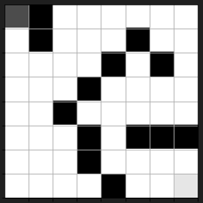
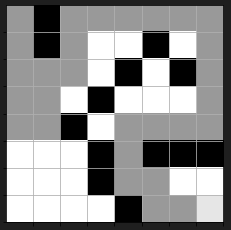

# Pirate Maze

This project uses Keras to program an intelligent agent to solve a maze puzzle. In this project I used:

- Python
- Jupyter Notebook
- Keras
- Deep Learning

The game starts with the agent at a random starting point:

and the objective is for the agent to navigate to the end point:

For this project, I was given all of the code leading up to the definition of the neural network. I provided the code that implemented the neural network itself.
Computer scientists solve problems through technology. This can be through software or through hardware, but they always attempt to come up with the most efficient solution possible.
I approach problems as a computer scientist with an eagerness to solve it first and foremost. Once the problem is solved, the new problem is: how can I improve this solution? In this way, problems and solutions are constantly evolving and developing and are never totally finished.
My ethical responsibilities to the end user and organization is to create and develop with intentionality and conscientious understanding of the impact of the decisions I make.
